# PoseTraj
### [CVPR 2025] PoseTraj: Pose-Aware Trajectory Control in Video Diffusion

Official implementation of paper "PoseTraj: Pose-Aware Trajectory Control in Video Diffusion".
The paper will be available soon.

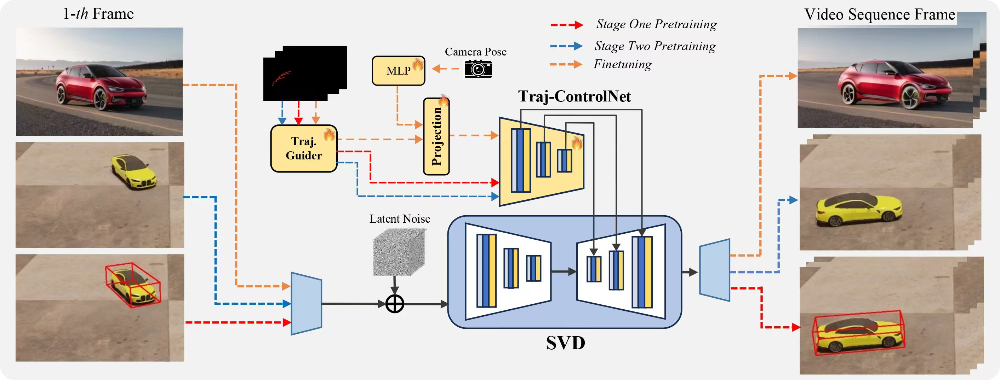  
 

## **Updates**

<!--- [ ] Mar. 13, 2024. Release the train code in **three month**.-->
- [ ] Support gradio demo/ More Checkpoints.
- [ ] Release checkpoint on VIPSeg.
- [ ] Release training and inference code.
- [x] Repo initalization.

---

## Abstract
Recent advancements in trajectory-guided video generation have achieved notable progress. 
However, existing models still face challenges in generating object motions with potentially changing 6D poses under wide-range rotations, due to limited 3D understanding. 
To address this problem, we introduce PoseTraj, a pose-aware video dragging model for generating 3D-aligned motion from 2D trajectories. 
Our method adopts a novel two-stage pose-aware pretraining framework, improving 3D understanding across diverse trajectories. 
Specifically, we propose a large-scale synthetic dataset PoseTraj-10k, containing 10k videos of objects following rotational trajectories, and enhance the model perception of object pose changes by incorporating 3D bounding boxes as intermediate supervision signals. 
Following this, we fine-tune the trajectory-controlling module on real-world videos, applying an additional camera-disentanglement module to further refine motion accuracy.
Experiments on various benchmark datasets demonstrate that our method not only excels in 3D pose-aligned dragging for rotational trajectories but also outperforms existing baselines in trajectory accuracy and video quality.

---

## Pose-Aware Dragging for Rotational Motions
<table class="center">
<tr>
    <td style="text-align:center;"><b>Input Image</b></td>
  <td style="text-align:center;"><b>Drag Trajectory</b></td>
      <td style="text-align:center;"><b>Generated Video</b></td>
</tr>
<tr>
  <td>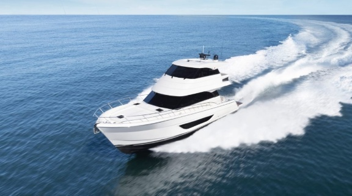</td>
  <td>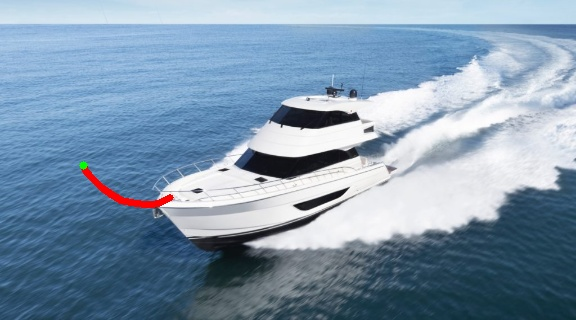</td>         
  <td></td>
</tr>
<tr>
  <td>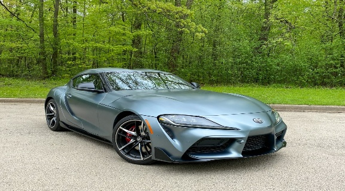</td>
  <td>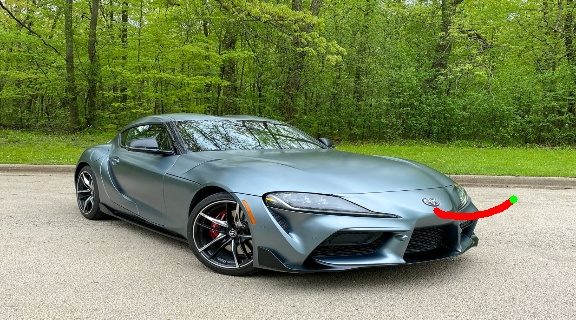</td>         
  <td>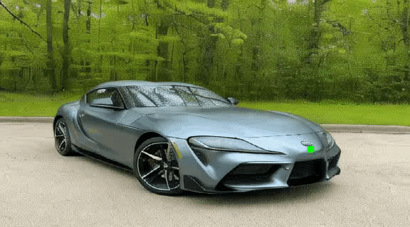</td>
</tr>
<tr>
  <td>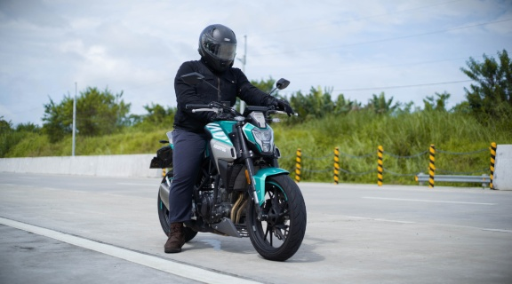</td>
  <td>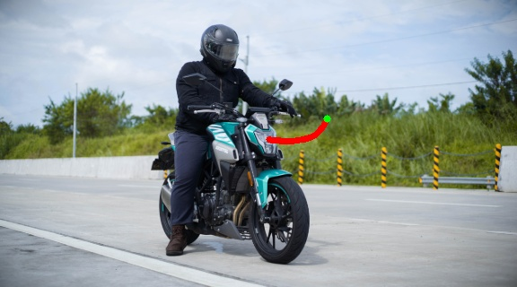</td>         
  <td></td>
</tr>
<tr>
  <td>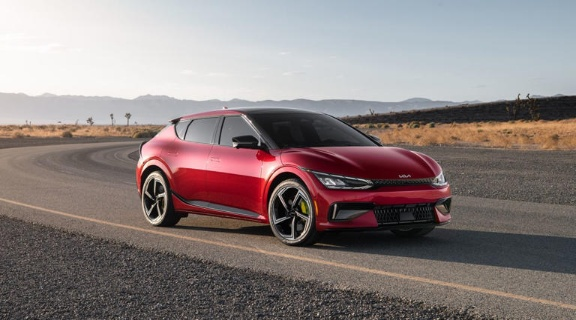</td>
  <td></td>         
  <td>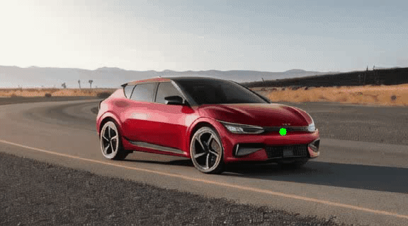</td>
</tr>
<tr>
  <td></td>
  <td>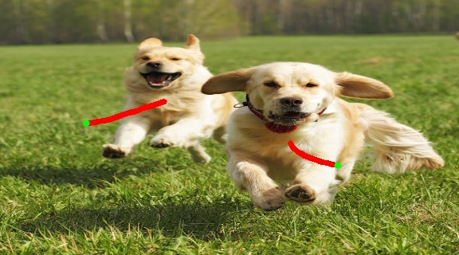</td>         
  <td>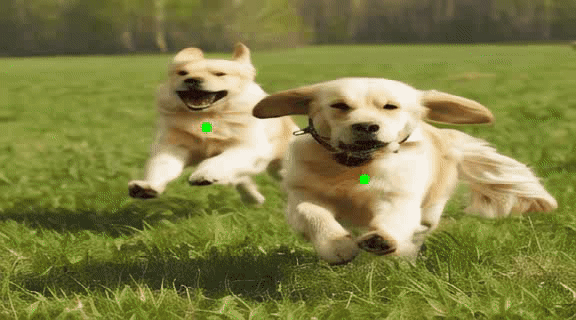</td>
</tr>
<tr>
  <td>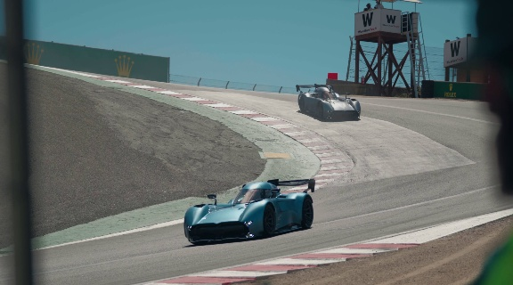</td>
  <td>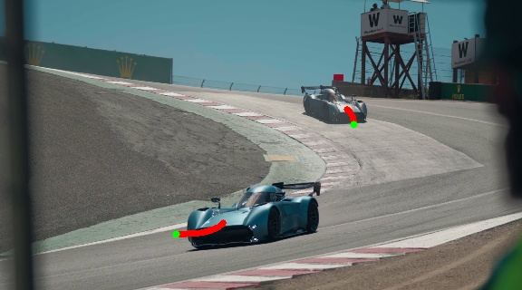</td>         
  <td>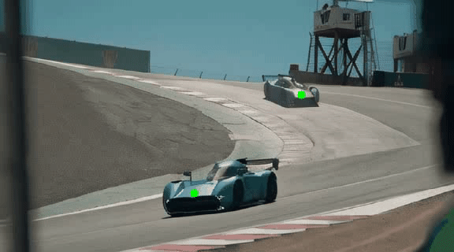</td>
</tr>

</table>
