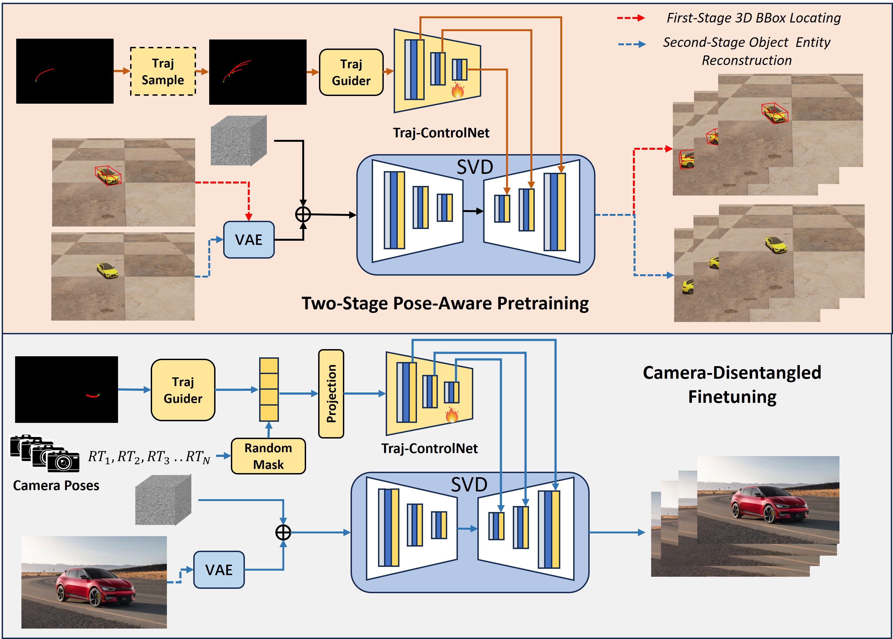

# PoseTraj
### [CVPR 2025] PoseTraj: Pose-Aware Trajectory Control in Video Diffusion

Official implementation of paper "PoseTraj: Pose-Aware Trajectory Control in Video Diffusion"

  
 

## **Updates**

<!--- [ ] Mar. 13, 2024. Release the train code in **three month**.-->
- [ ] Support gradio demo/ More Checkpoints.
- [ ] Release checkpoint on VIPSeg.
- [ ] Release training and inference code.
- [x] Repo initalization.

---

## Abstract
We introduce PoseTraj, ths first open-domain, Pose-Aware video dragging model for reliable 3D-aligned animations from 2D trajectories. Our method incorporates a novel Two-Stage Pose-Aware Pretraining framework, improving 3D understanding across diverse trajectories. Specifically, we 1) construct a large-scale synthetic dataset containing 10k videos of objects following rotational trajectories and 2) enhance the model perception of object pose changes by generating 3D bounding boxes as intermediate supervision signals. Following this, we fine-tune the trajectory-controlling module on open-domain videos, applying an additional camera disentanglement module to further refine motion accuracy. Experiments on various benchmark scenarios demonstrate that PoseTraj not only excels in 3D Pose-Aligned dragging for rotational scenarios but also outperforms existing baselines in trajectory accuracy and video quality.

---

## Pose-Aware Dragging for rotational motions
<table class="center">
<tr>
    <td style="text-align:center;"><b>Input Image</b></td>
  <td style="text-align:center;"><b>Drag Trajectory</b></td>
      <td style="text-align:center;"><b>Generated Video</b></td>
</tr>
<tr>
  <td></td>
  <td></td>         
  <td></td>
</tr>
<tr>
  <td></td>
  <td></td>         
  <td></td>
</tr>
<tr>
  <td></td>
  <td></td>         
  <td></td>
</tr>
<tr>
  <td></td>
  <td></td>         
  <td></td>
</tr>
<tr>
  <td></td>
  <td></td>         
  <td></td>
</tr>

</table>